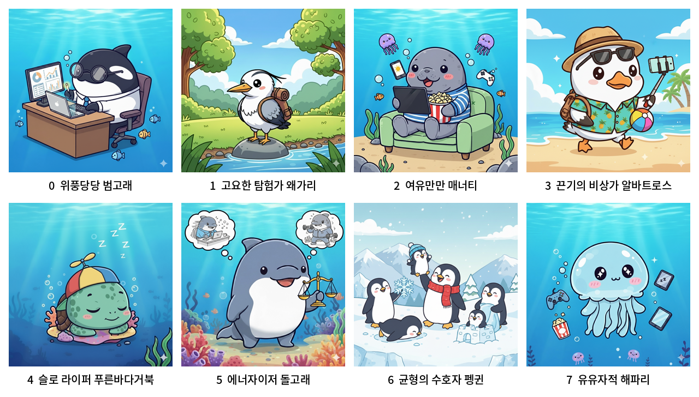
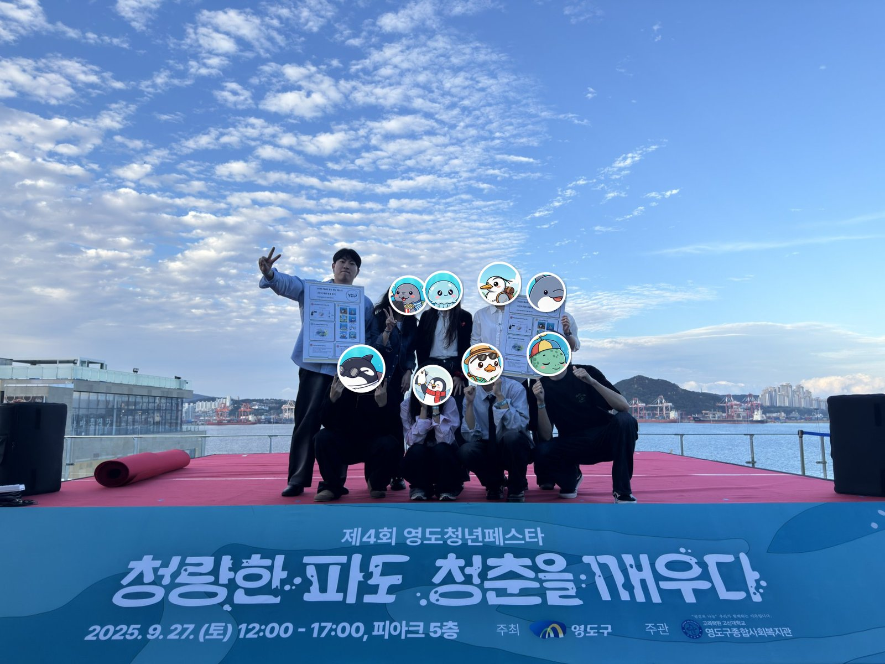
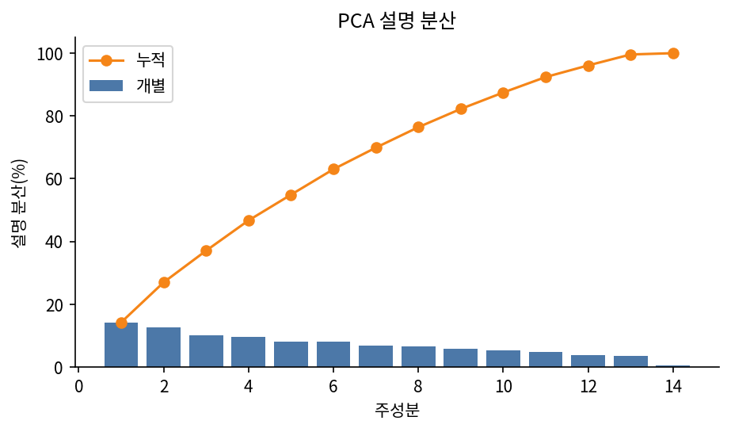
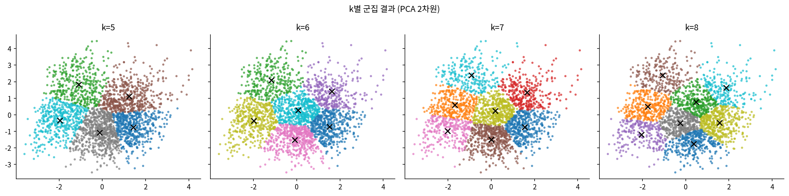
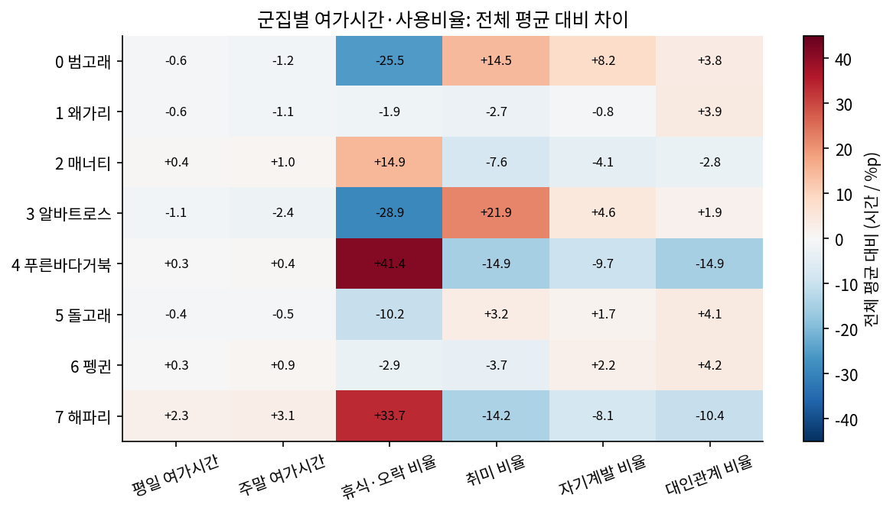
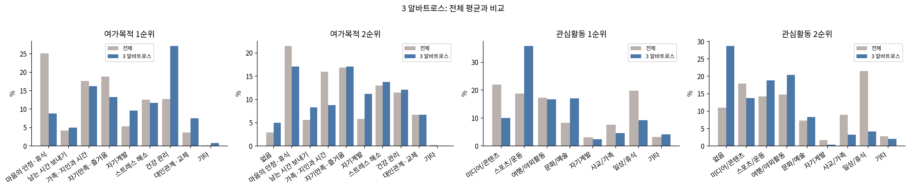

<div align="center">

# YDP.Lab: 여가생활 동물 유형 테스트

**설문 응답을 군집분석해 8가지 여가생활 유형으로 나누고, 각 유형을 닮은 해양 동물 캐릭터로 알려주는 웹 서비스**

2025 영도구청 청년 동아리 지원사업 · YDP 동아리 · 제4회 영도청년페스타 부스 운영


[서비스 화면](https://lun-lun-neko.github.io/ydplab/) · [분석 노트북](./analysis) · [동물 매핑 근거](./analysis/04_animal_mapping.md)



</div>

---

## 한눈에 보기

| 항목 | 내용 |
|---|---|
| 기간 | 2025.08 ~ 2025.09 |
| 배경 | 영도구청 청년 동아리 **YDP** · 제4회 영도청년페스타 부스 운영 |
| 데이터 | 여가생활 설문 **2,600명 × 14개 변수** |
| 모델 | 표준화 → PCA(2차원) → **K-Means(k=8)** |
| 결과물 | 설문 웹(React) · 예측 API(FastAPI) · 동물 캐릭터 8종 |
| **내 역할** | **데이터 분석**: 전처리, k 선정, 군집 분석, 동물 매핑, 이미지 생성 |

<p align="center"><br><sub>제4회 영도청년페스타 부스 운영 (2025.09.27) · 맨 왼쪽이 본인</sub></p>

## 서비스는 이렇게 동작합니다


파란 단계가 제가 설계·분석한 부분입니다. 사용자는 설문에 답하면 바로 자신의 동물 유형과 함께 **"왜 이 유형인지"를 보여주는 데이터 근거**(예: "휴식·오락 비율이 전체 평균의 2배")를 결과로 받습니다.

| 구분 | 구성 |
|---|---|
| `frontend/` | React + Vite. 설문 → 결과 페이지, 카카오 공유. GitHub Actions로 GitHub Pages 배포 |
| `backend/` | FastAPI. `GET /questions`(문항), `POST /questions`(예측 + 결과 반환). Docker로 Hugging Face Spaces 배포 |
| `analysis/` | **제가 진행한 군집분석 과정**을 재현 가능한 노트북으로 정리 |

---

## 내가 한 일

### 1. 데이터 전처리와 PCA → [`01_data_and_pca.ipynb`](analysis/01_data_and_pca.ipynb)

- 단위가 다른 변수(시간 0 ~ 18 / 비율 0 ~ 100 / 코드형 응답)가 거리 계산을 왜곡하지 않도록 **표준화**하고, 사용자가 일부 문항을 비워도 예측되도록 **평균 대치**를 파이프라인에 넣었습니다.
- 가구소득 `무응답`은 결측으로 지우지 않고 하나의 응답 범주로 유지했습니다(전체의 약 40%).
- 14차원을 **PCA 2차원**으로 축소했습니다. 설명 분산은 27%로 낮지만, 차원을 늘릴수록 군집 분리도(실루엣)가 오히려 떨어졌고, 2D에서 군집을 직접 보며 해석할 수 있다는 점을 우선했습니다.



### 2. 군집 수 선정: k = 5, 6, 7, 8 비교 → **k = 8 확정** → [`02_k_selection.ipynb`](analysis/02_k_selection.ipynb)

| k | 실루엣 계수 | 최소 군집 크기 |
|:-:|:-:|:-:|
| 5 | 0.331 | 383 |
| 6 | 0.358 | 306 |
| 7 | 0.339 | 236 |
| **8** | **0.328** | **220** |

- 실루엣 계수는 k=5 ~ 8에서 **0.33 ~ 0.36으로 거의 차이가 없어**, 지표만으로는 k를 정할 수 없었습니다.
- 그래서 **k를 늘렸을 때 새로 생기는 군집이 해석 가능한 유형인지**를 기준으로 판단했습니다. k=6 → 8에서 *돌고래와 섞여 있던 휴식형(매너티)*, *왜가리와 섞여 있던 '여가 최소·취미 최대'형(알바트로스)*, *여가시간이 가장 많은 미디어형(해파리)*이 각각 독립했습니다.
- 가장 작은 군집도 220명(8.5%)으로 충분히 컸고, 부스 체험형 테스트로서 8개 유형이 결과 다양성 면에서도 적절했습니다.



### 3. 군집별 특징 추출: 2·3·4번 심층 분석 → [`03_cluster_profiling.ipynb`](analysis/03_cluster_profiling.ipynb)

8개 군집의 지표를 전체 평균과 비교해 정리한 뒤, 특이점이 가장 뚜렷한 **2·3·4번 군집**을 소득 / 여가 목적 1·2순위 / 관심활동 1 ~ 5순위 / 여가시간 / 여가 사용 비율 단위로 깊게 분석했습니다.



| 군집 | 발견한 특이점 | 한 줄 요약 |
|:-:|---|---|
| **2** | 휴식·오락 **+14.9%p**, 여가목적 [마음의 안정·휴식] 압도적, **여가시간은 평균보다 많음** | 넉넉한 시간을 휴식으로 채우는 *여유형* |
| **3** | 여가시간 **8개 군집 중 최소**(평일 2.1h / 주말 3.6h)인데 취미 비율 **최대(40.8%)**, 관심활동 [스포츠/운동] 35.8%, 목적 [건강 관리] 평균의 2배 | 짧은 시간을 운동에 집중 투자하는 *효율형* |
| **4** | 휴식·오락 **83.6%로 최대**(+41.4%p), 취미·자기계발·대인관계 모두 **최소**, 목적 [남는 시간 보내기] 평균의 약 2배 | 혼자만의 휴식에 몰입하는 *슬로 라이프형* |



> 모든 지표는 군집 안의 인원수가 아니라 **전체 응답자 대비 비율(%p, 배수)** 로 비교했습니다. 예를 들어 3번 군집의 [건강 관리] 목적은 27.1%로 전체 평균(12.7%)의 2배 이상입니다.

### 4. 해양 동물 매핑 → [`04_animal_mapping.md`](analysis/04_animal_mapping.md)

군집의 핵심 지표 2 ~ 3개를 **실제 동물의 생태**와 연결했습니다. 외형이 아니라 습성이 맞아야 한다는 원칙으로 골랐습니다.

| 군집 | 핵심 지표 | 동물 | 연결 근거 |
|:-:|---|---|---|
| 2 | 여유 있는 시간 + 휴식 | **매너티** | 천적이 거의 없고 신진대사가 느려 서두를 필요가 없는 동물 |
| 3 | 짧은 시간 + 운동 집중 | **알바트로스** | 날갯짓을 최소화하고 바람을 이용해 효율적으로 수천 km를 비행 |
| 4 | 혼자 + 극단적 휴식 | **푸른바다거북** | 혼자 수면에 떠서 햇볕을 쬐며 에너지를 거의 쓰지 않음 |

같은 '휴식형'인 매너티(2) · 푸른바다거북(4) · 해파리(7)는 *여가시간의 양*, *교제 비율*, *여가 목적*으로 구분해 서로 다른 동물로 표현했습니다. 8개 전체 매핑은 [매핑 문서](analysis/04_animal_mapping.md)에 있습니다.

### 5. 캐릭터 이미지 생성: Gemini Imagen 3 → [`05_image_generation.md`](analysis/05_image_generation.md)

- 8종의 화풍을 통일하기 위해 *만화풍 · 굵은 외곽선 · 파스텔 · 1:1 · 캐릭터 중앙 배치*를 공통 조건으로 두었습니다.
- 동물만으로는 유형이 드러나지 않아 **군집 특성을 소품으로 표현**했습니다. 예를 들어 알바트로스에는 셀카봉·비치볼(짧은 여가에 여행·운동), 돌고래에는 저울(활동과 회복의 균형)을 넣었습니다.
- 후보 39장을 비교해 최종 8장을 골랐습니다.

---

## 배운 점

1. **지표가 비슷할 때 결정하는 기준**: 실루엣 계수가 k=5 ~ 8에서 비슷하게 나와 숫자만으로는 k를 고를 수 없었습니다. "늘어난 군집을 사용자에게 설명할 수 있는가"와 서비스 목적(체험형 테스트)을 함께 놓고 k=8로 결정하며, 통계 지표와 도메인 해석을 함께 쓰는 경험을 했습니다.
2. **항상 전체 평균과 비교하기**: 군집 하나만 보면 특징이 잘 드러나지 않아, 모든 지표를 **전체 평균 대비 차이(%p, 배수)** 로 해석했습니다. 이 방식이 결과 화면 문구("전체 평균 대비 2배")에도 그대로 쓰였습니다.
3. **분석 결과를 사용자의 언어로 번역하기**: '휴식 비율 84%, 교제 비율 최소'라는 지표는 자칫 부정적으로 읽힐 수 있습니다. 같은 사실을 '나만의 속도로 사는 슬로 라이퍼'처럼 낙인 없이 전달하는 표현을 고민했습니다.
4. **한계와 개선 방향**: 소득 구간·여가 목적·관심활동은 범주형 코드인데 숫자로 표준화해 거리 계산에 넣었습니다. 다시 한다면 원-핫 인코딩이나 **K-Prototypes / Gower distance** 같은 범주형 대응 군집 기법과 비교해 보고 싶습니다. PCA 2차원의 설명 분산(27%)이 낮은 점도 개선 과제입니다.

---

## 저장소 구조

```
ydplab/
├─ analysis/                  ← 데이터 분석 (내 담당)
│  ├─ common.py               공통 설정 (서비스와 동일한 파이프라인)
│  ├─ 01_data_and_pca.ipynb
│  ├─ 02_k_selection.ipynb
│  ├─ 03_cluster_profiling.ipynb
│  ├─ 04_animal_mapping.md
│  ├─ 05_image_generation.md
│  └─ figures/
├─ backend/                   FastAPI + scikit-learn (Hugging Face Spaces)
│  ├─ app/model/kmeansmodel.py   예측 파이프라인 + 유형별 결과 콘텐츠
│  ├─ data/mz_processed.csv      학습 데이터
│  └─ static/animals/            캐릭터 이미지
└─ frontend/                  React + Vite (GitHub Pages)
```

## 분석 재현

```bash
pip install -r analysis/requirements.txt
cd analysis && jupyter notebook
```

노트북은 `backend/data/mz_processed.csv`를 읽어 서비스와 같은 파이프라인(`random_state=42`)으로 결과를 재현합니다.

---

<sub>팀 프로젝트로 진행했으며 원본 저장소는 [lun-lun-neko/ydplabmodel](https://github.com/lun-lun-neko/ydplabmodel), [lun-lun-neko/ydplab](https://github.com/lun-lun-neko/ydplab)입니다. `frontend/`와 `backend/`는 원본 커밋 기록을 그대로 가져왔고, `analysis/`는 제가 담당한 분석 과정을 정리해 새로 작성했습니다. 이 결과는 의학적·심리학적 진단이 아닌 재미와 참고 목적의 데이터 분석 결과입니다.</sub>
