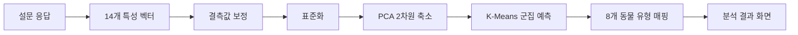

<div align="center">

# YDP.Lab 🐋

### 설문으로 발견하는 나의 여가생활 동물 유형

여가생활 설문 데이터를 군집분석해 사용자를 8가지 생활 유형으로 분류하고,  
각 유형을 닮은 동물 캐릭터와 데이터 기반 해석을 추천하는 웹 서비스입니다.

[서비스 체험](https://lun-lun-neko.github.io/ydplab/) · [API 문서](https://lunlunneko-ydplab.hf.space/docs) · [상세 프로젝트 문서](./YDP_Lab_Project_Summary.md)


</div>

---

## YDP.Lab은 어떤 서비스인가요?

사용자가 여가 목적, 평일·주말 여가시간, 활동별 사용 비율, 관심 여가활동 등에 답하면 모델이 응답 패턴을 분석합니다. 비슷한 여가생활을 가진 사용자를 하나의 군집으로 묶고, 군집의 특징을 가장 잘 보여주는 동물을 결과로 제공합니다.

단순히 동물 이름만 보여주는 것이 아니라 다음 정보도 함께 전달합니다.

- 나의 여가생활 유형과 한 줄 소개
- 유형을 대표하는 동물 캐릭터
- 군집의 행동 특성과 분석 요약
- 전체 응답자와 비교한 주요 지표
- 유형을 직관적으로 보여주는 키워드

> 이 결과는 의학적·심리학적 진단이 아닌, 설문 응답 패턴을 바탕으로 만든 재미와 참고 목적의 데이터 분석 결과입니다.

> 이 서비스는 2025 영도구 청년 동아리 활동 중 청년의 날 행사 부스 운영에 활용 되었으며 현재 데이터 수집이나 서버 관리 등은 이루어지고 있지 않습니다.

## 서비스 흐름



모델 입력은 가구소득, 여가 목적 1·2순위, 평일·주말 평균 여가시간, 네 가지 여가 사용 비율, 관심 여가활동 1~5순위의 총 14개 변수로 구성됩니다.

## 8가지 동물 유형

<table>
  <tr>
    <td align="center" width="25%"><br><b>위풍당당 범고래</b><br><sub>건강과 성장에 투자하는 주도형</sub></td>
    <td align="center" width="25%"><br><b>고요한 탐험가 왜가리</b><br><sub>자연과 편안한 교류를 즐기는 유형</sub></td>
    <td align="center" width="25%"><br><b>여유만만 매너티</b><br><sub>휴식과 자기돌봄을 사랑하는 유형</sub></td>
    <td align="center" width="25%"><br><b>끈기의 비상가 알바트로스</b><br><sub>짧은 시간에도 밀도 있게 움직이는 활동형</sub></td>
  </tr>
  <tr>
    <td align="center"><br><b>슬로 라이퍼 푸른바다거북</b><br><sub>혼자만의 안정적인 재충전을 즐기는 유형</sub></td>
    <td align="center"><br><b>에너자이저 돌고래</b><br><sub>활동과 회복의 리듬을 아는 유형</sub></td>
    <td align="center"><br><b>균형의 수호자 펭귄</b><br><sub>휴식·성장·관계를 조화시키는 균형형</sub></td>
    <td align="center"><br><b>유유자적 해파리</b><br><sub>평화와 회복을 우선하는 여유형</sub></td>
  </tr>
</table>

## 기술 스택

| 구분 | 기술 | 역할 |
|---|---|---|
| Backend | FastAPI, Pydantic | 설문 API와 요청 데이터 처리 |
| Data | pandas, NumPy | 학습 데이터 로딩과 입력 벡터 처리 |
| ML | scikit-learn | 결측값 보정, 표준화, PCA, K-Means |
| Static | FastAPI StaticFiles | 동물 이미지 제공 |
| Deploy | Docker, Hugging Face Spaces | 백엔드 컨테이너 배포 |
| Frontend | GitHub Pages | 설문 및 결과 화면 제공 |

## 프로젝트 구조

```text
ydplabfast/
├─ app/
│  └─ model/
│     ├─ kmeansmodel.py   # 군집 모델과 POST /questions
│     ├─ questionlist.py  # 질문 목록과 GET /questions
│     └─ submodel.py      # POST /v1/questions
├─ data/
│  └─ mz_processed.csv    # 전처리된 모델 학습 데이터
├─ static/
│  └─ animals/            # 8개 동물 PNG·SVG 이미지
├─ main.py                # FastAPI 앱과 라우터 등록
├─ Dockerfile             # Hugging Face Spaces 배포 설정
├─ requirements.txt
└─ YDP_Lab_Project_Summary.md
```


## API

### `GET /`

서버 상태를 확인합니다.

```json
{
  "status": "ok"
}
```

### `GET /questions`

프론트엔드에서 사용할 설문 문항과 선택지를 반환합니다.

### `POST /questions`

14개 설문 값을 받아 군집을 예측하고 동물 유형과 분석 결과를 반환합니다.

```json
{
  "householdIncome": 0,
  "leisurePurpose": 1,
  "leisurePurpose2": 6,
  "weekdayAvgLeisureTime": 5,
  "weekendAvgLeisureTime": 10,
  "restRecreationRate": 95,
  "hobbyRate": 0,
  "selfImprovementRate": 0,
  "socialRelationshipRate": 5,
  "leisureActivity1": 1,
  "leisureActivity2": 7,
  "leisureActivity3": 1,
  "leisureActivity4": 7,
  "leisureActivity5": 6
}
```

응답에는 동물 이름, 유형명, 소개, 동물 설명, 분석 요약, 주요 지표, 특성 키워드와 이미지 URL이 포함됩니다. 최신 계약은 실행 중인 서버의 [Swagger 문서](https://lunlunneko-ydplab.hf.space/docs)에서 확인할 수 있습니다.

### `POST /v1/questions`

테스트에 사용된 API 엔드포인트입니다.

## 모델 구성

```python
Pipeline([
    ("imputer", SimpleImputer(strategy="mean")),
    ("scaler", StandardScaler()),
    ("pca", PCA(n_components=2, random_state=42)),
    ("kmeans", KMeans(n_clusters=8, n_init="auto", random_state=42)),
])
```

- 결측값을 평균값으로 보정합니다.
- 서로 다른 척도의 입력 변수를 표준화합니다.
- PCA로 데이터를 2차원 공간에 투영합니다.
- K-Means로 8개 군집 중 하나를 예측합니다.
- 군집 번호를 동물 유형과 분석 콘텐츠에 매핑합니다.

모델 선정 과정, 군집별 상세 해석과 알려진 한계는 [프로젝트 종합 문서](./YDP_Lab_Project_Summary.md)를 참고해 주세요.

## 배포

백엔드는 Docker SDK를 사용하는 Hugging Face Spaces에 배포됩니다. 저장소 루트의 YAML 메타데이터와 `Dockerfile`에 따라 컨테이너가 `7860` 포트에서 실행됩니다. 프론트엔드는 GitHub Pages에서 서비스되며 배포된 FastAPI 서버를 호출합니다.

| 서비스 | 주소 |
|---|---|
| 웹 서비스 | <https://lun-lun-neko.github.io/ydplab/> |
| API 서버 | <https://lunlunneko-ydplab.hf.space/> |
| API 문서 | <https://lunlunneko-ydplab.hf.space/docs> |
| Hugging Face Space | <https://huggingface.co/spaces/lunlunneko/YDPLab> |

## 알려진 개선사항

- API 응답 필드 오탈자와 `/questions`, `/v1/questions` 계약 통합
- 설문 값 범위, 순위 중복, 네 가지 사용 비율 합계에 대한 서버 검증
- 서버 시작 시 재학습하는 모델을 버전이 지정된 아티팩트로 전환
- 범주형 변수에 적합한 인코딩·거리 기반 군집 방법과 결과 비교
- 질문과 유형 설명을 Python 코드에서 JSON/YAML 등으로 분리
- 모델 변화에 따라 군집별 수치와 설명을 자동으로 동기화
- 모델 예측과 군집-동물 매핑에 대한 자동화 테스트 추가

## 보안

- 액세스 토큰과 비밀키는 코드, README, Git 이력에 커밋하지 않습니다.
- 로컬에서는 환경변수 또는 `.env`를 사용하고, 배포 환경에서는 Hugging Face Secrets를 사용합니다.
- 이미 노출된 토큰은 삭제만 하지 말고 반드시 폐기한 후 재발급해야 합니다.

## 문서

Notion에 흩어져 있던 설계, 군집분석, API, 배포 기록을 통합한 상세 문서는 아래에서 확인할 수 있습니다.

- [YDP.Lab Project 종합 문서](./YDP_Lab_Project_Summary.md)

---

<div align="center">

데이터로 발견하고, 동물로 기억하는 나의 여가생활 유형 🐧

</div>
